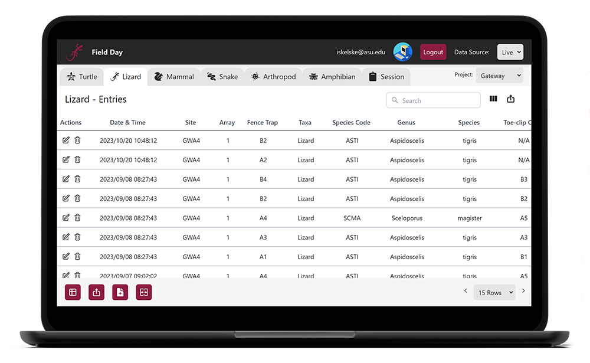

# Hello, I'm Ian Skelskey 👋

I'm a software engineer based in Connecticut. I currently work as an Evergreen Systems Specialist at Bibliomation Inc., where I manage and contribute to the open-source Evergreen ILS, a robust library system serving Connecticut's largest library consortium. With a B.S. in Software Engineering from Arizona State University and an A.S. in Computer Science and Mathematics from CT State Tunxis, I combine technical expertise with a passion for creative problem-solving and continuous learning.

## 🎯 Current Focus

- Maintaining and improving the Evergreen Integrated Library System (ILS).
  - I now have code and documentation included in four minor releases: [3.11](https://evergreen-ils.org/documentation/release/RELEASE_NOTES_3_11.html), [3.12](https://evergreen-ils.org/documentation/release/RELEASE_NOTES_3_12.html), [3.13](https://evergreen-ils.org/documentation/release/RELEASE_NOTES_3_13.html), and [3.14](https://evergreen-ils.org/documentation/release/RELEASE_NOTES_3_14.html).
- Developing [evergit](https://github.com/IanSkelskey/evergit), a globally deployable npm tool for automating commit messages in Evergreen repositories. Easily install it using `npm install -g evergit` and run it in any Git repository.
- Reconnecting with my artistic roots and updating my DeviantArt account, [IanSkelskey](https://www.deviantart.com/ianskelskey), after a decade.

## 🛠️ Tech Stack


## 📈 GitHub Stats

<a href="https://github.com/IanSkelskey">
	
</a>
<a href="https://github.com/IanSkelskey">
	
</a>

## 🎮 Current Learning Journey

- Expanding my expertise with technologies related to Evergreen, including PostgreSQL, Perl, and Angular.
- Completing Harvard's CS50 Introduction to Game Development on edX at my own pace.
- Studying Spanish to broaden my communication skills.
- Supporting the 2024 Field Day capstone team at ASU by providing technical guidance and support.

## Featured Projects

### 🌲 Evergreen Integrated Library System (ILS)

A comprehensive open-source library system supporting large-scale library consortia. Learn more on the [Evergreen Website](https://evergreen-ils.org/).

Contributed docs, features and fixes in the following releases:

[](https://evergreen-ils.org/documentation/release/RELEASE_NOTES_3_11.html)
[](https://evergreen-ils.org/documentation/release/RELEASE_NOTES_3_12.html)
[](https://evergreen-ils.org/documentation/release/RELEASE_NOTES_3_13.html)
[](https://evergreen-ils.org/documentation/release/RELEASE_NOTES_3_14.html)

### 🛠️ `evergit`

[](https://www.npmjs.com/package/evergit)
[](https://github.com/IanSkelskey/evergit)

A CLI tool to streamline commit message generation for Evergreen code contributions. **Install globally**:

```bash
npm install -g evergit
```

#### Usage

1. Navigate to any Git repository.
2. Run `evergit commit` in the terminal.

Explore the tool on [npm](https://www.npmjs.com/package/evergit) or [GitHub](https://github.com/IanSkelskey/evergit).

> Requires an OpenAI API key to generate commit messages. A Launchpad account is not required, but recommended. Commit messages will be written based on the context prvided by the Launchpad ticket.

### 🦎 Field Day



A comprehensive data collection and management tool for wildlife researchers in Arizona, sponsored by Dr. Heather Bateman from ASU.

Visit the [Field Day Organization](https://github.com/Field-Day-2022) for more information.

## ⚡ Fun Fact
I enjoy writing and playing music in my spare time and am proficient in guitar and piano.
