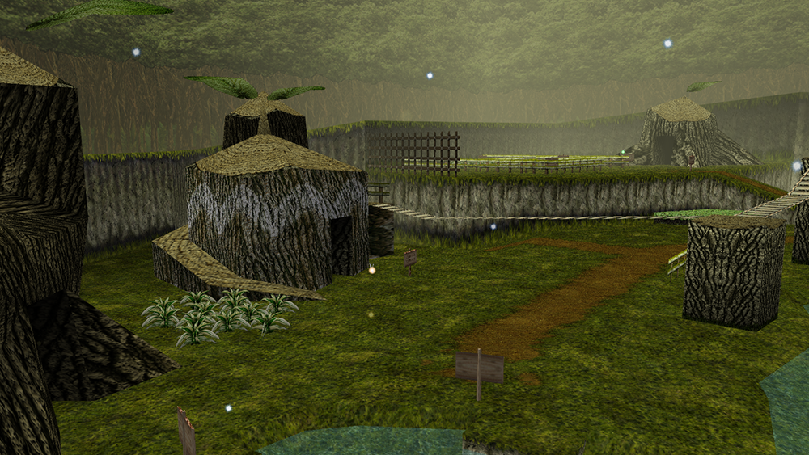

### Hello, I'm Ian Skelskey 👋

I'm a freelance software engineer based in Connecticut, specializing in game development and web applications. Currently, I'm developing MIDI software for the Godot engine and for web for my clients. With a B.S. in Software Engineering from Arizona State University and an A.S. in Computer Science and Mathematics from CT State Tunxis, I combine technical proficiency with creative flair in all my projects.

### 🎯 Current Focus

- Providing freelance software services, with a focus on game development using Godot and web applications.
- Actively seeking new opportunities where creativity and innovation are valued.

### 👨‍💻 Tools & Technologies

#### Web Development

#### Game Development

#### Languages

#### Tools

#### Development Environment

### 🎮 Current Learning Journey

- Continuously enhancing my skills in game development and interactive media.
- Enrolled in CS50's Introduction to Game Development through Harvard and edX, progressing at my own pace.
- Studying the Spanish language to broaden my communication skills.

### Projects

#### 🎁 Holiday Toy Drive for Connecticut Children's Medical Center

Developed a vibrant and interactive website for organizing and participating in toy drives. Built with React and styled using Tailwind CSS.

[Visit the website!](https://ianskelskey.github.io/toy.drive/)
[Check out the code!](https://github.com/IanSkelskey/toy.drive)

#### 🦎 Field Day Project

A comprehensive data collection and management tool for wildlife researchers in Arizona, sponsored by Dr. Heather Bateman from ASU.

[More about Field Day](https://github.com/Field-Day-2022)

#### ⚔️ Ocarina of Time Community Retexture V7

Contributed to the community-driven retexturing project for Zelda: Ocarina of Time.

- [Project Thread on EmuTalk](https://www.emutalk.net/threads/zelda-ocarina-of-time-community-retexture-project-v7.55307/)
- [Hosted on Emulation King](https://emulationking.com/loz-ocarina-of-time-community-retexture/)
- [Featured Video by Hydef Hyde](https://www.youtube.com/watch?v=ommmSq5YeXE&t=13s)

#### ⚡ Fun Fact

I enjoy writing and playing music in my spare time, proficient in guitar and piano.
