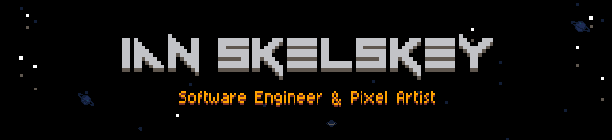
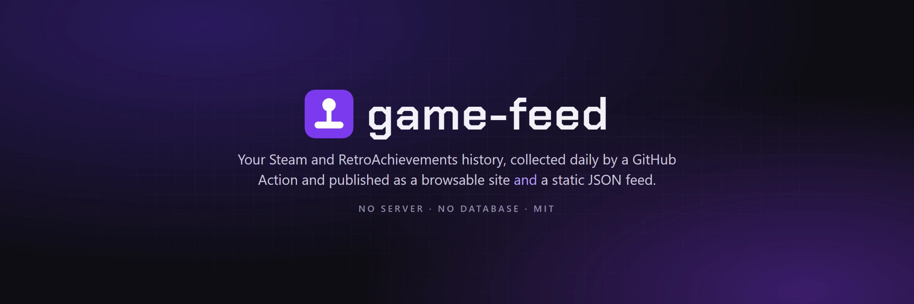
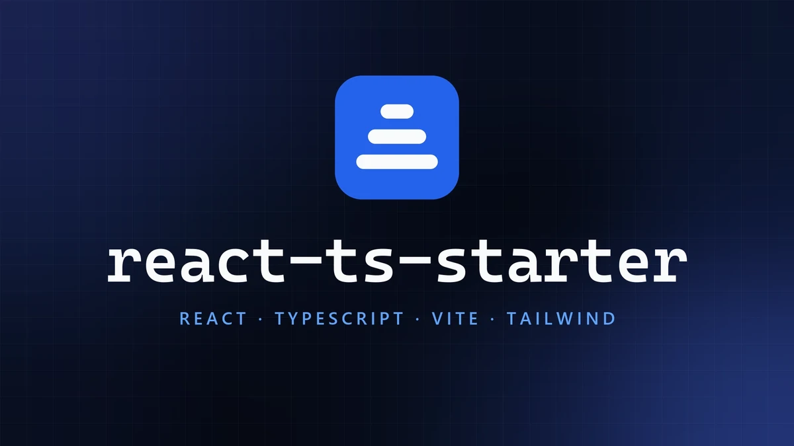
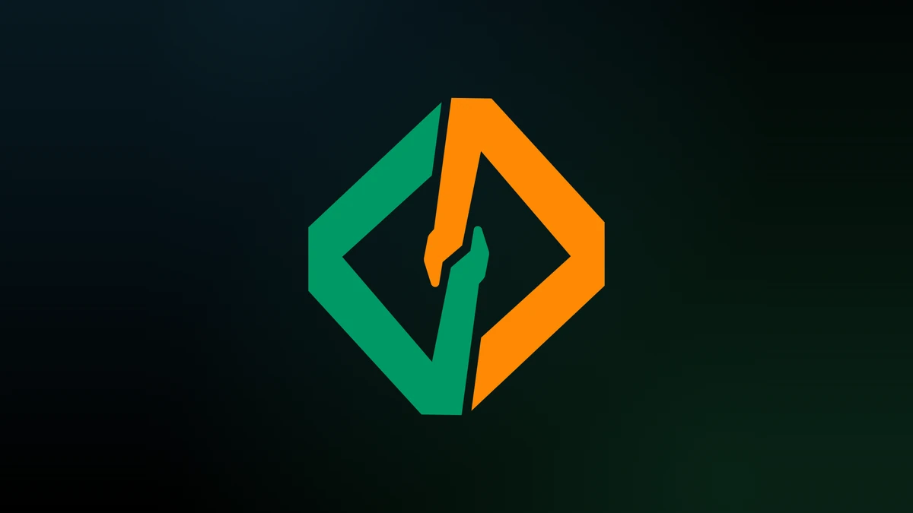
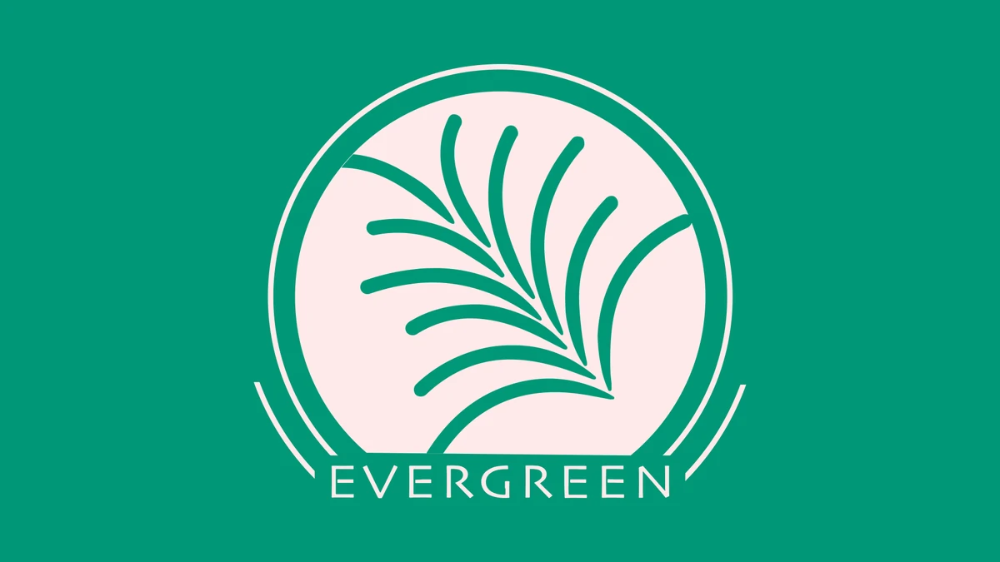
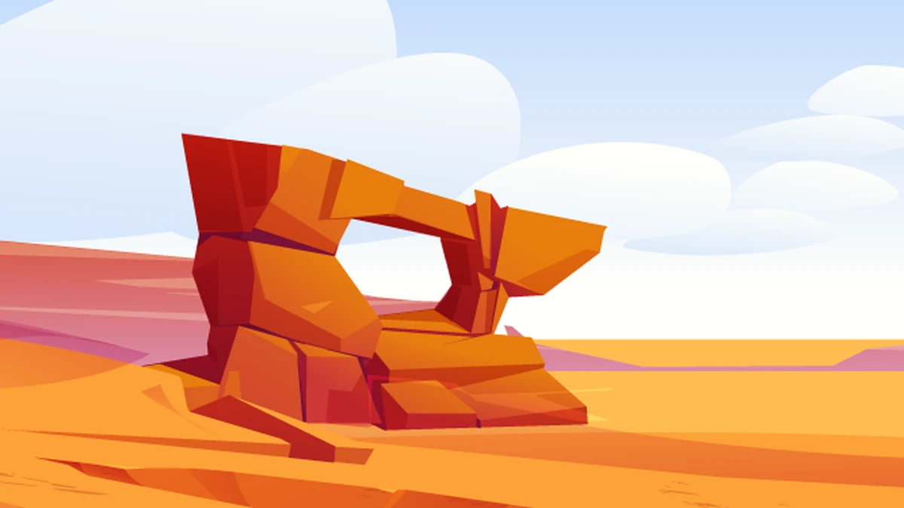
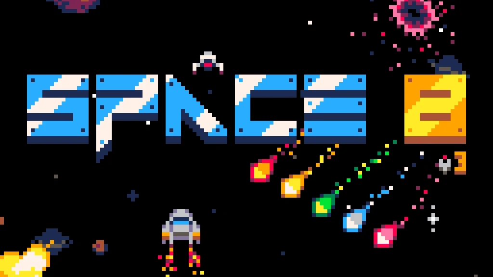
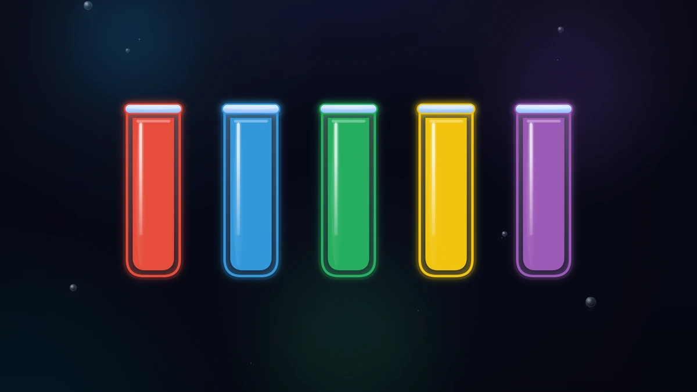
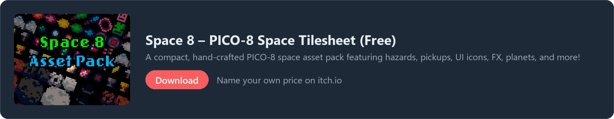
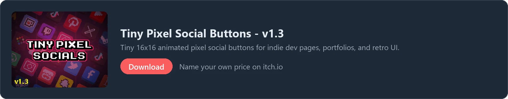

**Software engineer building systems, tools, and games.**

I work in the **Evergreen ILS** ecosystem as an Evergreen Systems Specialist at **Bibliomation Inc.**, on open-source library software serving Connecticut's largest library consortium. On my own time I build developer tools, small browser games, and pixel art.

## Projects

  <b><a href="https://github.com/IanSkelskey/game-feed">game-feed</a></b> 
  Publish your gaming history as a site and a JSON feed 
  Template · 2026  
  
  
  

<table>
  <tr>
    <td width="50%" align="center">
       
      <b><a href="https://github.com/IanSkelskey/react-ts-starter">react-ts-starter</a></b> 
      An opinionated React + TypeScript starting point 
      MIT · 2026  
      
      
      
    </td>
    <td width="50%" align="center">
       
      <b><a href="https://github.com/IanSkelskey/collab-code">Collab Code</a></b> 
      Collaborative coding rooms for classrooms &amp; tutoring 
      In development · 2026  
      
      
      
    </td>
  </tr>
  <tr>
    <td width="50%" align="center">
       
      <b><a href="https://github.com/IanSkelskey/Evergreen">Evergreen ILS</a></b> 
      Open-source library system for large-scale consortia 
      Contributions in releases <a href="https://evergreen-ils.org/documentation/release/RELEASE_NOTES_3_11.html">3.11</a>+  
      
      
      
    </td>
    <td width="50%" align="center">
       
      <b><a href="https://github.com/Field-Day-2022">Field Day</a></b> 
      Wildlife research data management tool 
      ASU capstone · maintained since 2022  
      
      
      
    </td>
  </tr>
</table>

## Play in your browser

<table>
  <tr>
    <td width="50%" align="center">
       
      <b><a href="https://ianskelskey.itch.io/space-8">Space 8</a></b> 
      PICO-8 arcade delivery shooter 
      Free on itch.io · 2025  
      
      
      
    </td>
    <td width="50%" align="center">
       
      <b><a href="https://ianskelskey.github.io/liquid-sort/">Liquid Sort</a></b> 
      Alchemical puzzle game 
      Plays in browser · 2026  
      
      
      
    </td>
  </tr>
</table>

## Pixel art & game assets

Free asset packs on itch.io — pixel art drawn under tight constraints, mostly for PICO-8.

## Elsewhere

  &nbsp;&nbsp;&nbsp;&nbsp;&nbsp;
  &nbsp;&nbsp;&nbsp;&nbsp;&nbsp;
  &nbsp;&nbsp;&nbsp;&nbsp;&nbsp;
  &nbsp;&nbsp;&nbsp;&nbsp;&nbsp;
  &nbsp;&nbsp;&nbsp;&nbsp;&nbsp;
  &nbsp;&nbsp;&nbsp;&nbsp;&nbsp;
  &nbsp;&nbsp;&nbsp;&nbsp;&nbsp;
  

