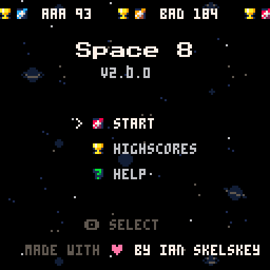
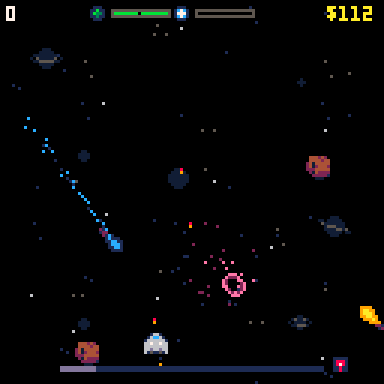
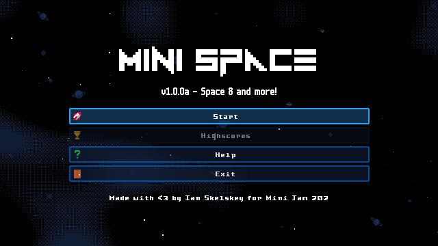
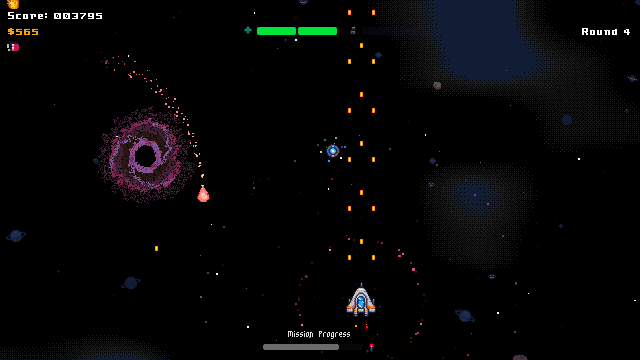

# Hello, I'm Ian Skelskey 👋

Software engineer in Connecticut. Evergreen Systems Specialist at Bibliomation Inc., contributing to open-source library software serving Connecticut's largest library consortium. B.S. Software Engineering (ASU), A.S. Computer Science & Mathematics (CT State Tunxis).

---

## 📈 GitHub Stats

---

## Featured Projects

### 🌲 Evergreen ILS

Open-source library system powering large-scale consortia. I contribute features, fixes, and documentation. Presenting on **opt-in settings** at the [Evergreen Conference](https://evergreen-ils.org/) in April 2026.

**My contributions:** [3.11](https://evergreen-ils.org/documentation/release/RELEASE_NOTES_3_11.html) · [3.12](https://evergreen-ils.org/documentation/release/RELEASE_NOTES_3_12.html) · [3.13](https://evergreen-ils.org/documentation/release/RELEASE_NOTES_3_13.html) · [3.14](https://evergreen-ils.org/documentation/release/RELEASE_NOTES_3_14.html) · [3.15](https://evergreen-ils.org/documentation/release/RELEASE_NOTES_3_15.html) · [3.16](https://evergreen-ils.org/documentation/release/RELEASE_NOTES_3_16.html)

I also manage the [Bibliomation GitHub organization](https://github.com/Bibliomation-Inc) and developed the WordPress theme for [biblio.org](https://biblio.org).

### 🛠️ evergit

CLI tool to streamline commit message generation for Evergreen contributions.

---

### 🎮 Game Development

I build retro arcade games using **PICO-8** and **Godot**, and I've been actively participating in game jams.

#### Space 8 — PVGD PICO Jam 2025

Classic arcade-style vertical shooter. Features progressive difficulty, multiple obstacle types, and retro particle effects.

 

#### Mini Space — Mini Jam 202

Spiritual sequel to Space 8. Features asteroids, comets, black holes with gravity physics, and mission-based progression. Created for [Mini Jam 202: Power-up](https://itch.io/jam/mini-jam-202-power-up).

 

---

### 🦎 Field Day

Data collection tool for wildlife researchers in Arizona, sponsored by Dr. Heather Bateman (ASU). Visit the [Field Day Organization](https://github.com/Field-Day-2022) to learn more.

---

## Featured Artwork

---

## Fun Fact

I enjoy writing and playing music—guitar and piano are my instruments of choice.
